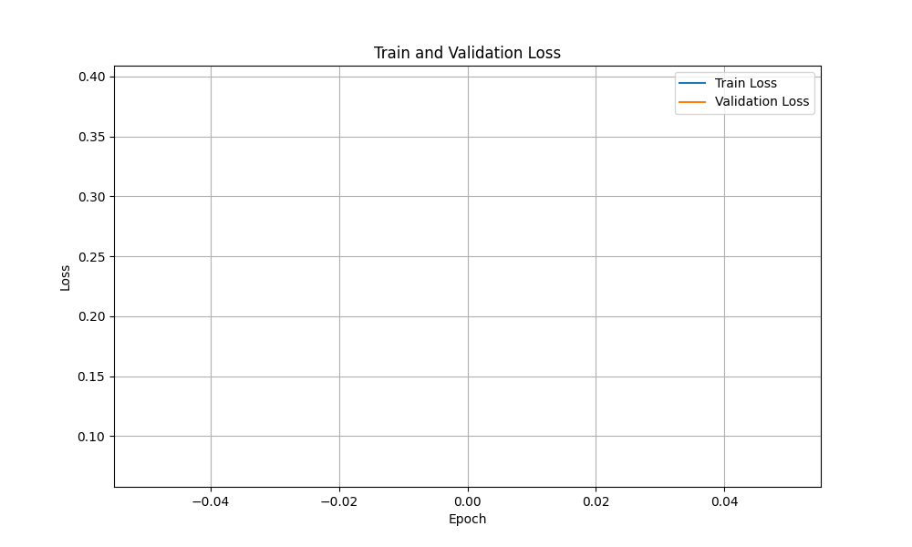

# **FaceNet**

Implementação e treinamento de uma rede neural siamesa que extrai embeddings de imagens do dataset MNIST utilizando a função de perda Triplet Loss

## **Motivação**

A motivação para a implementação desse projeto é resultado da tentativa da implementação do paper FaceNet. Essa implementação serviu como estudo e prática do treinamento com Triplet Loss e do processo de triplet mining/triplet selection. O próximo passo é a implementação e o treinamento da FaceNet. 

## **Treinamento**

O treinamento se inicia com semi-hard triplets (margin 1.0) pos 40% das epochs e altera para negative hard triplets para o resto das epochs. A rede é treinada por 20 epochs, utilizando o otimizador Adam com learning rate inicial de 1e-4, sendo reduzido para 1e-5 após 15 epochs, batch size de 256 imagens e a mesma margem do mining para a loss (1.0). O embedding size resultante é de 64 dimensões. A cada epoch, é calculada a validation loss em cima de 128 triplets selecionados aleatóriamente no início da execução.  

Para treinar o modelo, basta instalar as dependências (Python 3.10.12)
```
pip install -r requirements
```
e executar o script ./train.sh (talvez seja necessário dar permissão de execução ao script: chmod +x train.sh).

Alguns dos parâmetros de treinamento são customizáveis como flags na execução.
    
- *num_images* (int): Número de imagens (default: 59904)
- *batch_size* (int): Tamanho do batch (default: 256)
- *epochs* (int): Número de epochs (default: 20)
- *margin* (float): Margem para triplet loss (default: 1.0)
- *num_workers* (int): Número de workers para o DataLoader (default: 0)
- *data_path* (str): Caminho para o dataset (default: ./data/)
- *checkpoint_path* (str): Caminho para salvar os checkpoints (default: ./checkpoints/)

Os demais parâmetros (learning rate, step do scheduler, etc) devem ser alterados diretamente no arquivo train.py.

O script train.sh contém:
```
python3 train.py 
        --num_images 59904 
        --batch_size 256
        --epochs 20 
        --margin 1 
        --num_workers 0 
        --data_path ./data/ 
        --checkpoint_path ./checkpoints/
```

O download do dataset MNIST é feito automaticamente ao executar o script de treinamento e conta com 60.000 imagens de treino e 10.000 imagens de teste.

## **Avaliação**

A avaliação do modelo é feita utilizando o notebook eval.ipynb e é realizada para cada epoch.

1024 pares de imagens (512 positivos e 512 negativos) são gerados aleatóriamente para o cálcula das métricas:
- **Accuracy**: o threshold utilizado para o cálculo da acurácia é baseado no FAR (False Acceptance Rate) de 0.1%.
```math
accuracy = \frac{\sum_{i=1}^{n} (distance_i < threshold) == label_i}{n}
```
Sendo a distância calculada utilizando a norma L2 entre os embeddings dos pares.
- **VAL (Validation Rate)**: 
```math
VAL = \frac{TP}{TP + FN}
```

É possível visualizar a média e o desvio padrão das distâncias dos pares positivos e , além do threshold baseado no FAR. São plotados os gráficos da distribuição das distâncias dos pares positivos e negativos e um t-SNE plot dos embeddings. Ao final do treinamento, é salvo também um gráfico das perdas de treinamento e validação a cada epoch.

## **Resultados**

O modelo mais treinado e com melhor performance está em [./models/epoch_20.pt](models/) e apresentou os seguintes resultados:

| Métrica | Valor |
| :---: | :---: |
| Target FAR | 1e-03 |
| Threshold | 0.8916 |
| Accuracy | 0.9717 |
| VAL | 0.9434 |
| Positive distances | 0.4232 ± 0.2290 |
| Negative distances | 1.4625 ± 0.1223 |

<br>





## **Referências**
- FaceNet: A Unified Embedding for Face Recognition and Clustering - [arXiv:1503.03832](https://arxiv.org/abs/1503.03832)
- Omoindrot: [Blog post](https://omoindrot.github.io/triplet-loss#triplet-mining) e [GitHub repo](https://github.com/omoindrot/tensorflow-triplet-loss)
- Reddit: [r/MachineLearning - [D] Preventing Triplet networks from collapse](https://www.reddit.com/r/MachineLearning/comments/88by8i/d_preventing_triplet_networks_from_collapse/)
